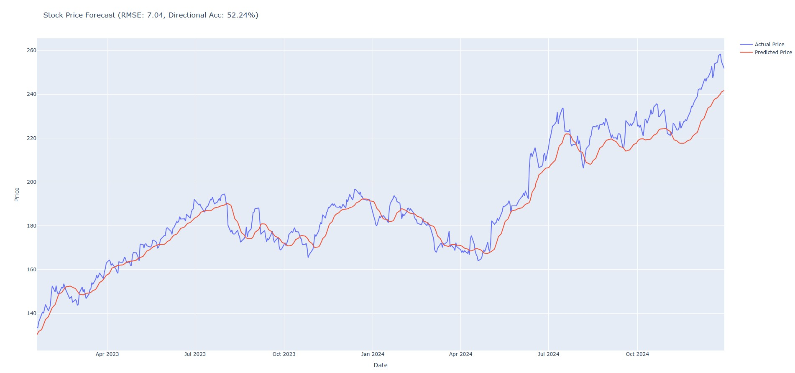

# 📈 LSTM Stock Price Forecasting

This project builds a deep learning model to forecast future stock prices using historical OHLCV (Open, High, Low, Close, Volume) data. It uses an LSTM architecture and automatically imports data via the `yfinance` API — no manual CSV files required.

 

---

## 🚀 Key Features

- Fetches stock price data programmatically with `yfinance`
- Prepares time-series data using windowed sequences and normalization
- Trains a stacked LSTM model for next-step forecasting
- Evaluates model with RMSE, MAE, and directional accuracy
- Generates interactive plots (actual vs. predicted) using Plotly

---

## 🧰 Tech Stack

- **Python 3.x**
- [yfinance](https://pypi.org/project/yfinance/)
- [TensorFlow/Keras](https://www.tensorflow.org/)
- [scikit-learn](https://scikit-learn.org/)
- [NumPy](https://numpy.org/)
- [Plotly](https://plotly.com/python/)

---

## ⚙️ How It Works

```text
1. Choose your stock ticker (default: AAPL)
2. Automatically download historical stock data (2015–2024)
3. Normalize and sequence the data for time-series modeling
4. Train an LSTM model on past prices
5. Predict and visualize future prices with performance metrics
