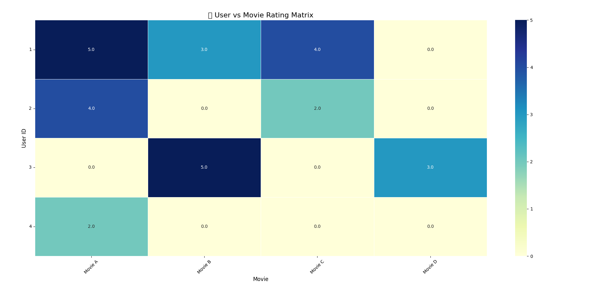

# 📽️ User-Based Recommender System (Pandas + Cosine Similarity)

This project implements a lightweight and explainable **user-based collaborative filtering recommender system** using only `pandas` and `scikit-learn`.

> It predicts movie preferences for users by analyzing the rating patterns of similar users.

---

## 🚀 Features

- ✅ Pure Python implementation (no `Surprise`, `LightFM`, or `implicit`)
- ✅ Cosine similarity on **normalized (centered) user-item matrix**
- ✅ Fallback to **popular items** when no strong neighbors exist
- ✅ Human-readable recommendation output
- ✅ Clear similarity and interaction **heatmaps**
- ✅ Ideal for learning, demos, and prototyping

---

## 🧾 Sample Dataset

```plaintext
| user_id | item     | rating |
|---------|----------|--------|
| 1       | Movie A  | 5      |
| 1       | Movie B  | 3      |
| 1       | Movie C  | 4      |
| 2       | Movie A  | 4      |
| 2       | Movie C  | 2      |
| 3       | Movie B  | 5      |
| 3       | Movie D  | 3      |
| 4       | Movie A  | 2      |
```
## 🧾 User Similary Heatmap


